# HEI Boot


HEI Boot 是开源可改的一体化脚手架：**Spring Boot 后端 + 管理端 / 门户 / UniApp 前端**同仓维护。一般挂业务、改配置即可跑；复杂场景可直接改 `common/*`。

- 后端：JDK 21 · Spring Boot 4.1 · Maven 多模块 · PostgreSQL · Redis · Sa-Token · MyBatis-Plus · JustAuth
- 前端：`web/admin`（Vue 3 / Naive UI）· `web/portal`（React / Ant Design）· `web/admin-uniapp`（uni-app）
- 约定：Java 驼峰；对外 JSON 字段 `snake_case`；标量（含 boolean / 数字）以**字符串**收发（`StringlyTypedJacksonModule`）

文档索引：[docs/README.md](docs/README.md)

> **生产注意：** 首次上线后务必轮换 seed 超管密码与密钥；关闭文档/Actuator 公网暴露；仅在可信反向代理后开启 `hei.security.trust-forwarded-headers`。HSTS 优先在 Ingress 配置。

## 生产状态

以下姊妹项目均已在本公司项目中投产：

| 项目 | 说明 | 协议 |
| :--- | :--- | :--- |
| [**hei-boot**](https://github.com/jiangbyte/hei-boot) | Spring Boot 工程化脚手架 | Apache License 2.0 |
| [**hei-gin**](https://github.com/jiangbyte/hei-gin) | Go 轻量级后端框架 | MIT |
| [**hei-fastapi**](https://github.com/jiangbyte/hei-fastapi) | FastAPI 原型项目（早期阶段，仅供参考） | MIT |

**统一说明：**

- 以上均为个人维护的开源框架，起源是给自己攒一套通用、灵活、多账户体系的开发框架，不做强绑定，图个省事。在公司项目中直接用了，**非公司内部框架产物**。
- 公司内部基于各框架有定制化修改，内部版本与公共仓库**存在差异**，公共仓库更新相对较慢（看鄙人是否有时间了，当然也在用AI积极迁移中......）。
- **本项目不涉及任何公司机密信息，无版权争议！！**

## 架构

可运行后端应用：

| 应用 | 路径 | 说明 |
|------|------|------|
| Admin API + SnailJob 客户端 | `app/admin` | 业务 API；内嵌 SnailJob Executor（group `hei_boot_admin`）；Flyway 权威源 |

业务由 `app/admin` **显式依赖**装配。样板 `module/biz` 在 Maven profile `with-biz`（默认开启）；生产打包排除：

```bash
mvn -pl app/admin -am -P'!with-biz' package -DskipTests
```

### 模块一览

| 层 | 内容 |
|----|------|
| `common/*` | web / mybatis / redis / satoken / security / log / oss / job / notify / doc … |
| `module-api/*` | 跨模块窄接口（auth / iam / sys / user） |
| `module/*` | auth · iam · sys · user · message · dashboard · biz（样板） |
| `web/*` | 独立前端工程，无 `web/packages` 共享层 |

## 功能概览

**认证（`module/auth`）**

- 双端登录：ADMIN / PORTAL（Sa-Token + Redis 会话）
- 账号 / 邮箱 / 手机号；密码与 OTP；图形验证码；忘记 / 重置密码
- 三方登录（JustAuth）：GitHub、Gitee、微信开放平台；门户另有微信小程序 code 登录
- 绑定表 `auth_account_oauth_binding`（Flyway `V5`）；系统配置可开关各 Provider

**业务能力**

- IAM / RBAC、用户中心、在线会话
- 系统：字典、配置、Banner、文件、弱口令、审计、代码生成
- 消息：公告、通知、反馈（即时通讯已移除）
- Dashboard；Redis Stream 操作审计异步落库
- SnailJob：注销清理、Banner 状态同步、审计量级告警

**前端**

| 工程 | 端口（默认） | 说明 |
|------|--------------|------|
| [web/admin](web/admin/README.md) | 5173 | 管理端：动态路由、IAM、系统、消息、OAuth 入口 |
| [web/portal](web/portal/README.md) | 5174 | 门户：全页登录/注册/找回密码、公告、反馈、个人中心 |
| [web/admin-uniapp](web/admin-uniapp/README.md) | — | 管理端 H5 / 小程序 |

## 运行要求

- JDK 21、Maven 3.9+、pnpm（前端）
- PostgreSQL、Redis
- 本地 SnailJob Server（独立容器，见 `script/docker/docker-compose.snailjob.yml`）

## 快速启动

### 1. 基础设施

```bash
docker compose -f script/docker/docker-compose.yml up -d
```

详情：[script/docker/README.md](script/docker/README.md)

### 2. 后端

```bash
# SnailJob Server（已有 Postgres 上先建 snail_job + Flyway）
bash script/docker/snailjob-flyway.sh
docker compose -f script/docker/docker-compose.snailjob.yml up -d

# 管理端 API（含 SnailJob 客户端）
mvn -pl app/admin -am spring-boot:run
```

```text
Admin API:          http://127.0.0.1:8000
Knife4j:            http://127.0.0.1:8000/doc.html
Actuator health:    http://127.0.0.1:8000/actuator/health
SnailJob Console:   http://127.0.0.1:9189/snail-job   (admin / 123456)
SnailJob RPC:       17888
```

默认库：`jdbc:postgresql://127.0.0.1:5432/hei_boot`（`hei` / `hei`）

### 3. 前端

```bash
cd web/admin && pnpm install && pnpm dev     # http://127.0.0.1:5173
cd web/portal && pnpm install && pnpm dev    # http://127.0.0.1:5174
```

`VITE_API_URL` 留空时走同源 `/api`，由 Vite 代理到 `http://127.0.0.1:8000`。

### 默认账号

| 端 | 地址 | 账号 | 密码 |
|----|------|------|------|
| Admin | http://localhost:5173 | `superadmin` | `123456` |
| Portal | http://localhost:5174 | `user` | `123456` |

管理端 `superadmin` 由 Flyway seed；**生产首次启动后必须改密**。登录需图形验证码（哈希缓存在 Docker Redis，key 形如 `captcha:{id}`，TTL 约 5 分钟）。

### 界面预览

**Portal**

<table>
  <tr>
    <td width="50%">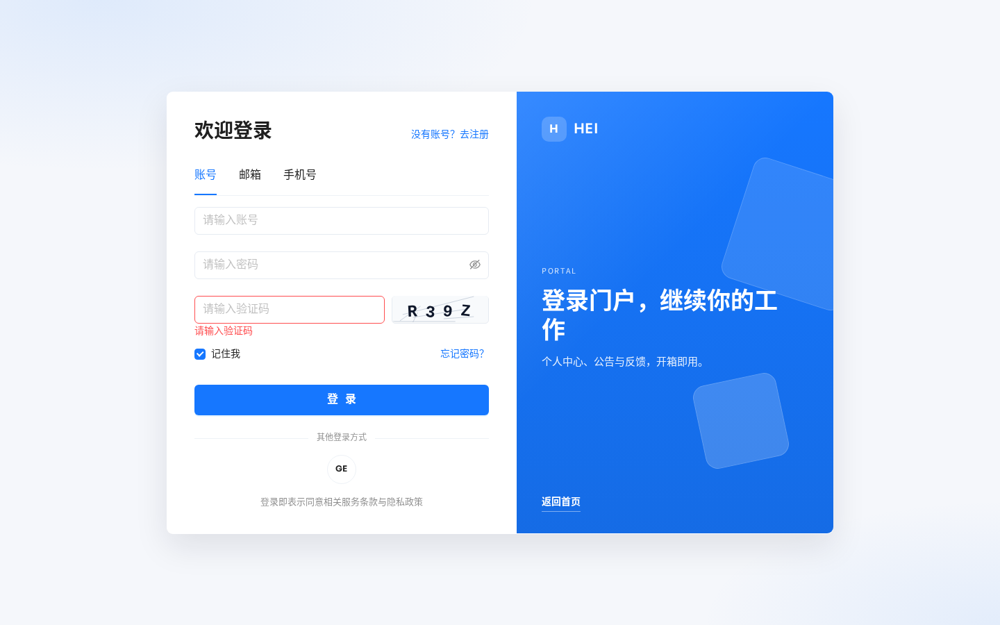</td>
    <td width="50%">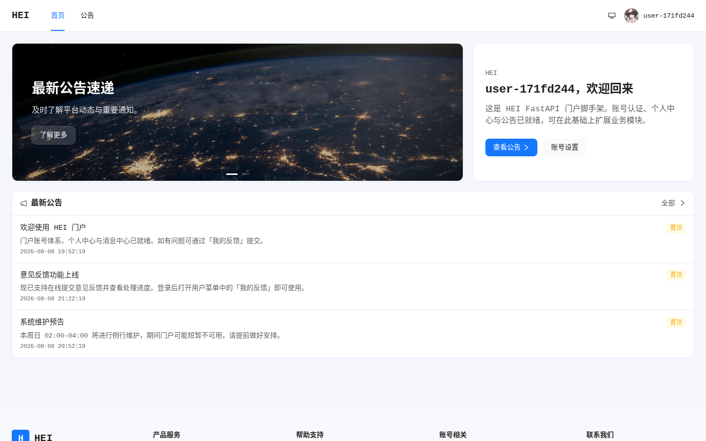</td>
  </tr>
  <tr>
    <td align="center">登录</td>
    <td align="center">首页</td>
  </tr>
</table>

**Admin · 登录 / 工作台**

<table>
  <tr>
    <td width="50%">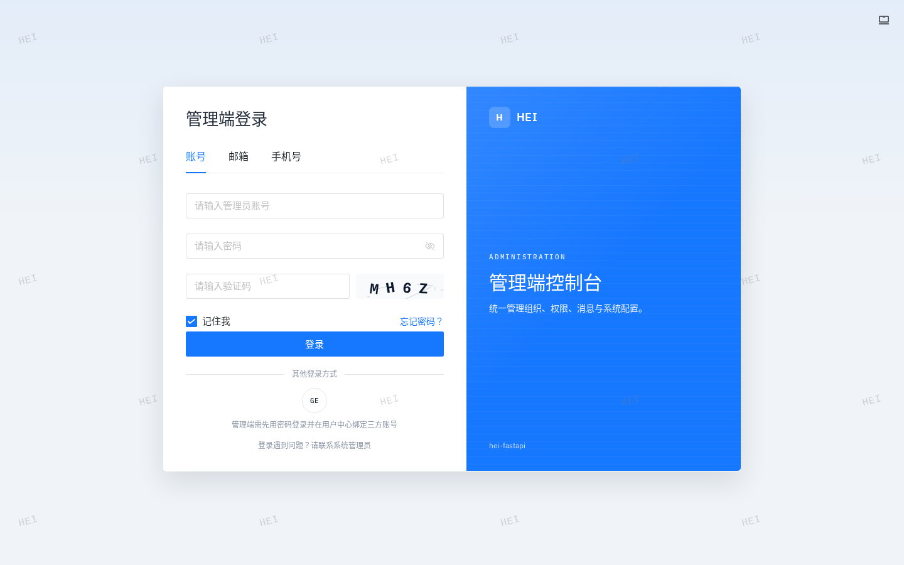</td>
    <td width="50%">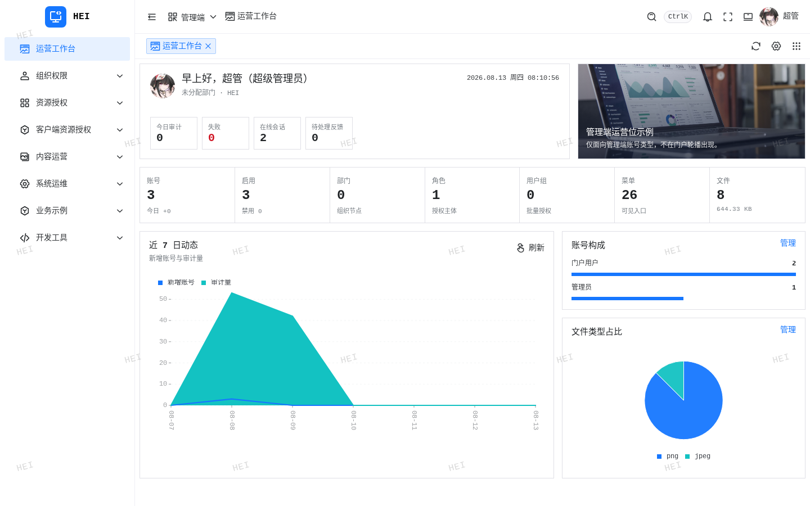</td>
  </tr>
  <tr>
    <td align="center">登录</td>
    <td align="center">运营工作台</td>
  </tr>
</table>

**Admin · 组织权限（IAM）**

<table>
  <tr>
    <td width="50%">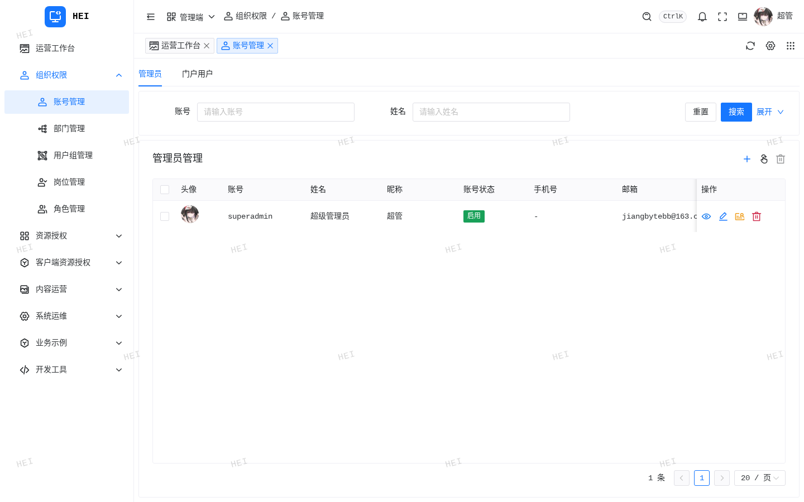</td>
    <td width="50%">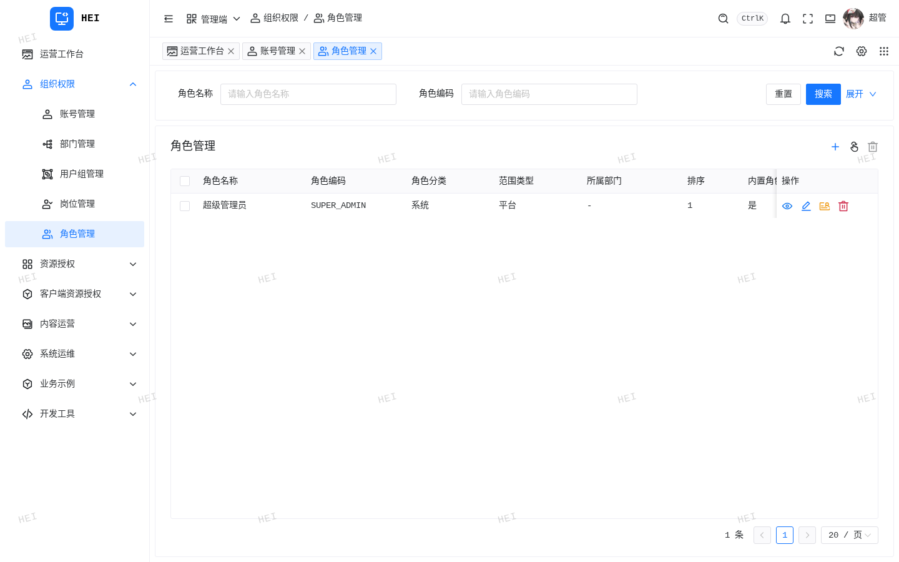</td>
  </tr>
  <tr>
    <td align="center">账号管理</td>
    <td align="center">角色管理</td>
  </tr>
  <tr>
    <td></td>
    <td></td>
  </tr>
  <tr>
    <td align="center">部门管理</td>
    <td align="center">用户组管理</td>
  </tr>
  <tr>
    <td></td>
    <td></td>
  </tr>
  <tr>
    <td align="center">岗位管理</td>
    <td></td>
  </tr>
</table>

**Admin · 资源授权**

<table>
  <tr>
    <td width="50%">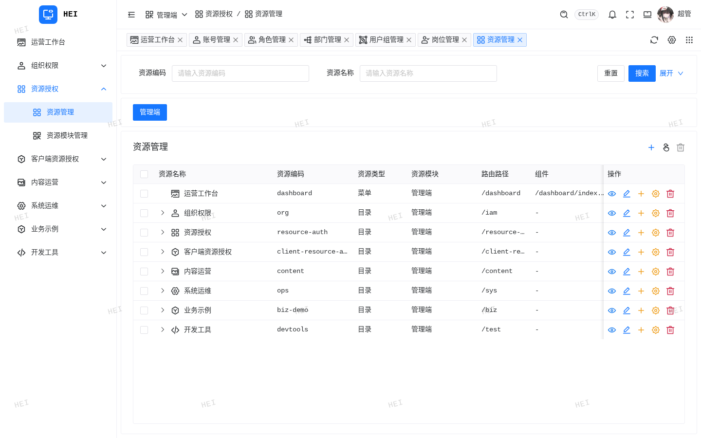</td>
    <td width="50%"></td>
  </tr>
  <tr>
    <td align="center">资源管理</td>
    <td align="center">资源模块</td>
  </tr>
  <tr>
    <td>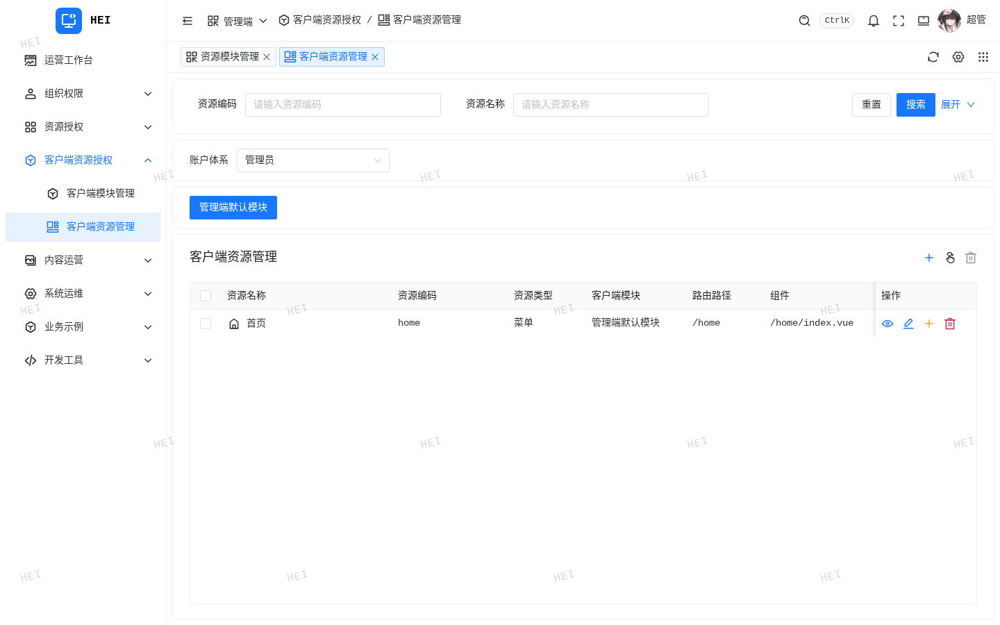</td>
    <td></td>
  </tr>
  <tr>
    <td align="center">客户端资源</td>
    <td></td>
  </tr>
</table>

**Admin · 内容运营**

<table>
  <tr>
    <td width="50%"></td>
    <td width="50%"></td>
  </tr>
  <tr>
    <td align="center">通知消息</td>
    <td align="center">反馈管理</td>
  </tr>
</table>

**Admin · 系统运维**

<table>
  <tr>
    <td width="50%">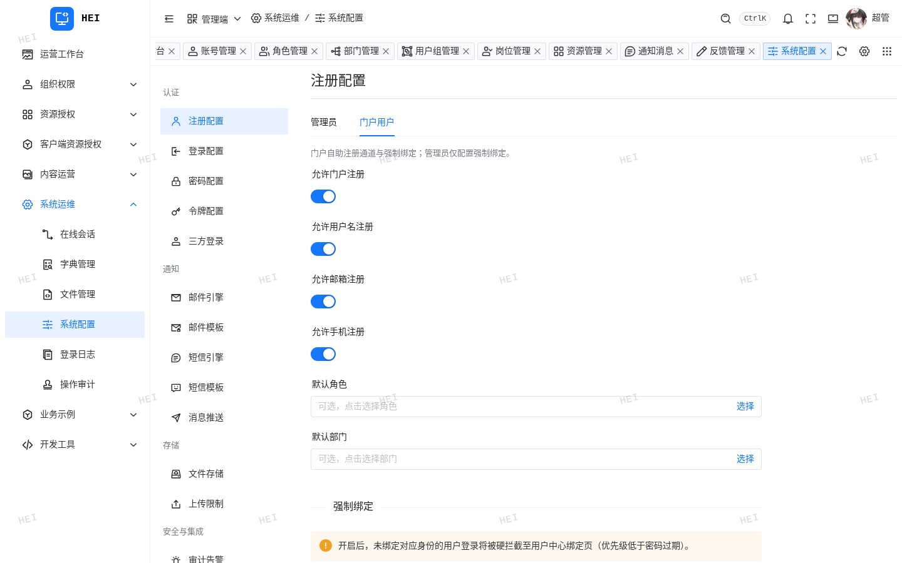</td>
    <td width="50%">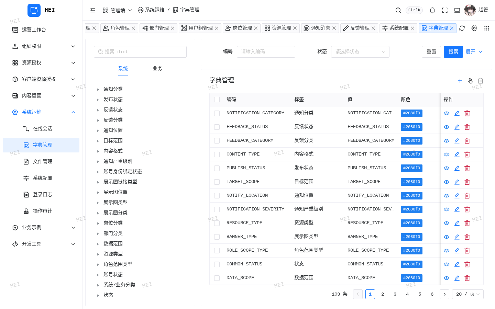</td>
  </tr>
  <tr>
    <td align="center">系统配置</td>
    <td align="center">字典管理</td>
  </tr>
  <tr>
    <td>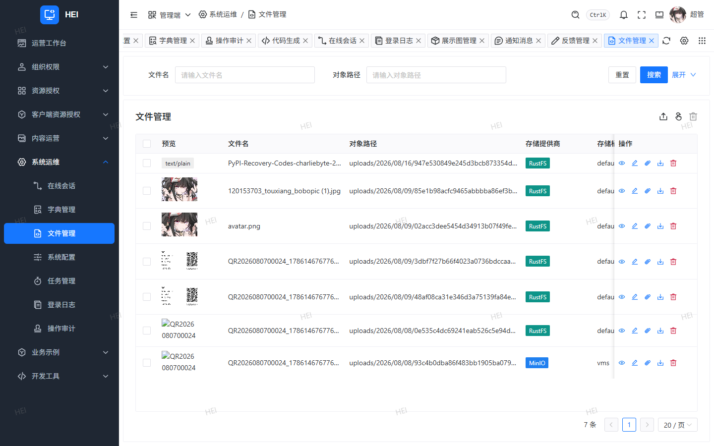</td>
    <td></td>
  </tr>
  <tr>
    <td align="center">文件管理</td>
    <td align="center">展示图 / Banner</td>
  </tr>
  <tr>
    <td></td>
    <td>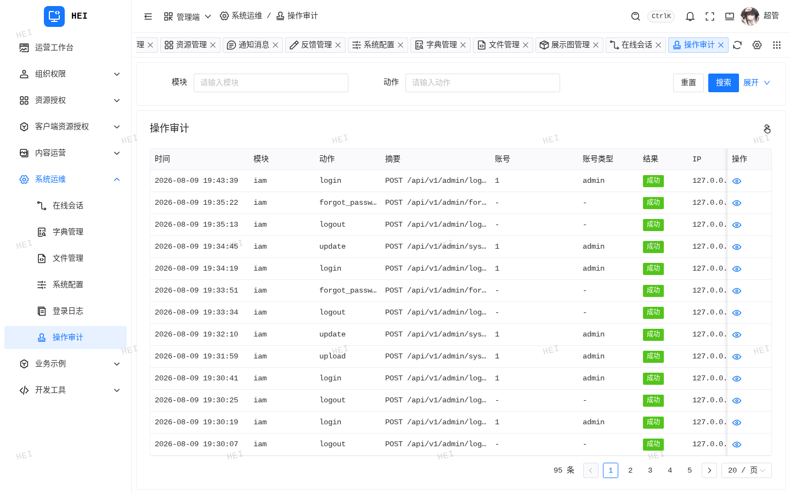</td>
  </tr>
  <tr>
    <td align="center">在线会话</td>
    <td align="center">操作审计</td>
  </tr>
  <tr>
    <td></td>
    <td></td>
  </tr>
  <tr>
    <td align="center">登录日志</td>
    <td></td>
  </tr>
</table>

**Admin · 开发工具 / 业务示例**

<table>
  <tr>
    <td width="50%">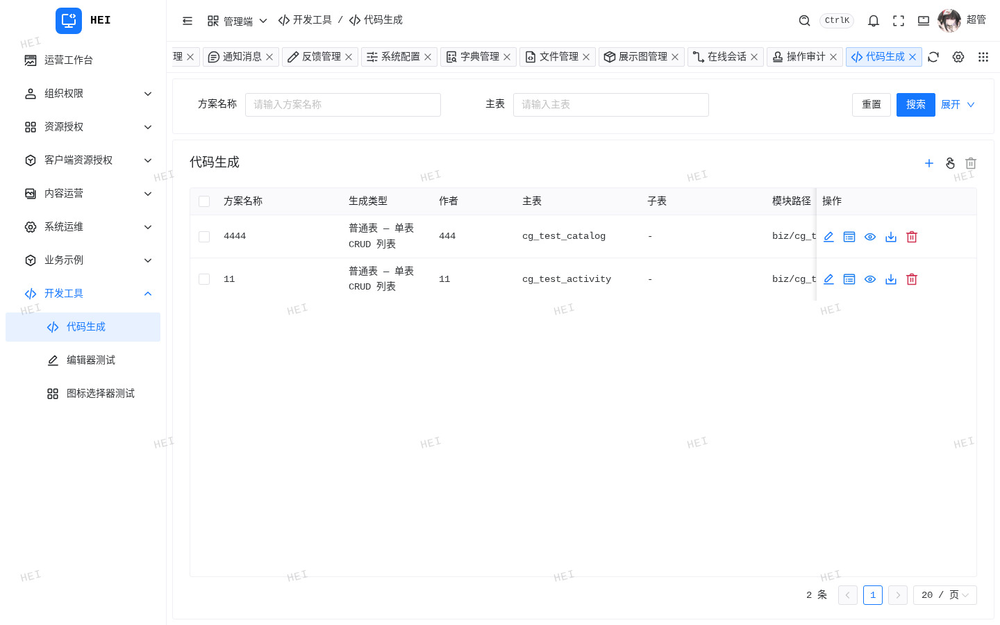</td>
    <td width="50%">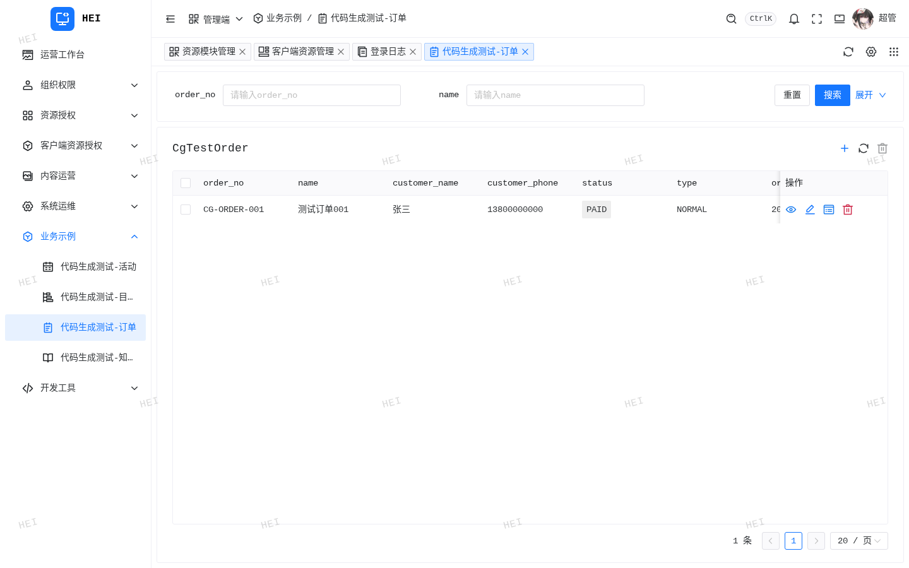</td>
  </tr>
  <tr>
    <td align="center">代码生成</td>
    <td align="center">业务示例 · 订单</td>
  </tr>
</table>

## 主要 API 前缀

| 前缀 | 用途 |
|------|------|
| `/api/v1/admin/**` | 管理端 |
| `/api/v1/portal/**` | 门户端 |
| `/api/v1/files/**` | 公开读文件（可配置） |
| `/api/*/internal/**` | 集群内部（勿对公网暴露） |
| `/actuator/**` | 健康与指标（勿对公网暴露） |
| `/doc.html`、`/v3/api-docs` | OpenAPI / Knife4j |

常用：`/api/v1/admin/login`、`/captcha`、`/oauth/**`、`/iam/**`、`/sys/**`、`/user-center/**`、`/message/**`。

## 会话与安全（摘要）

- **双通道**：`token-name=Authorization`；始终可读 Header；Cookie 由 `SA_TOKEN_IS_READ_COOKIE` 开关。
- Cookie 开：HttpOnly `Authorization`，Path 按端隔离为 `/api/vN/{admin|portal}`；登录 JSON 仍返回 `token`。
- Cookie 关：仅认 opaque `Authorization` 头（非 Bearer）。
- 生产 Cookie：`SA_TOKEN_IS_READ_COOKIE=true`、`SA_TOKEN_COOKIE_SECURE=true`、`SameSite=Lax`。
- CORS：默认放行本地 5173 / 5174 / 5163；`hei.security.cors-allowed-origins: ["*"]` 时通配且关闭 credentials。

## 生产部署

- **不要**把 SnailJob Server 打进业务镜像；生产外接调度中心（默认 `SNAIL_JOB_ENABLED=false`）。
- Kubernetes 参考：[deploy/helm/hei-boot](deploy/helm/hei-boot/)（Service 端口 **8000**）。
- 生产包排除样板业务：`mvn -pl app/admin -am -P'!with-biz' -DskipTests package`。

```bash
export SNAIL_JOB_ENABLED=true
export SNAIL_JOB_SERVER_HOST=snail-job.example.com
export SNAIL_JOB_SERVER_PORT=17888
export SNAIL_JOB_NAMESPACE=764d604ec6fc45f68cd92514c40e9e1a
export SNAIL_JOB_GROUP=hei_boot_admin
export SNAIL_JOB_TOKEN=your_token
```

### 生产必填环境变量

| 变量 | 说明 |
|------|------|
| `DB_URL` / `DB_USERNAME` / `DB_PASSWORD` | 主库（也可用 `DB_WRITE_*` / `DB_READ_*`） |
| `REDIS_HOST`（及可选 port / password / database） | 会话与 Redis Stream 审计 |
| `HEI_CONFIG_CRYPTO_KEY` | 敏感配置 Fernet 密钥（无默认值） |

可选：`SNAIL_JOB_*`、`HEI_LOG_AUDIT_CONSUME_ENABLED`、`HEI_VAULT_*`、`LOG_JSON`、`HEI_SECURITY_TRUST_FORWARDED_HEADERS`。

## 二次开发

1. 在 `module/` 新增业务：`@AutoConfiguration` + `@ComponentScan` + `AutoConfiguration.imports`；跨模块契约放 `module-api/`。
2. 登记 reactor（`module/pom.xml`），根 `pom.xml` `dependencyManagement` 增加版本条目。
3. 在 `app/admin/pom.xml` **显式依赖**该模块（样板 `biz` 走 `with-biz`；自有业务放主 dependencies）。
4. 库表 / 菜单种子：仅在 `app/admin/src/main/resources/db/migration/` **追加** `V{n}__*.sql`（业务建议高序号如 `V100__`）。**勿改**已发布的 `V1`–`V5`。
5. 配置改 `application-*.yml` 或环境变量（如 `hei.security.ignore-urls`）。

会话、过滤器、安全装配等在 `common/*`，允许直接改源码；跟上游合并时自行解决冲突。

## SnailJob 任务

客户端 group：`hei_boot_admin`；namespace：`764d604ec6fc45f68cd92514c40e9e1a`。

| Executor | 模块 | Cron | 作用 |
|----------|------|------|------|
| `accountPurgeCancelledJob` | iam | `0 0 3 * * ?` | 清理超保留期注销账号 |
| `bannerStatusJob` | sys | `0 */5 * * * ?` | 按时间启用 / 停用 Banner |
| `auditAlertJob` | sys | `0 */2 * * * ?` | 审计量超阈值写入告警 |

本地：`script/sql/postgres/snailjob/` + `script/docker/snailjob-flyway.sh` + `docker-compose.snailjob.yml`。
曾用过 XXL 的库可执行 `script/sql/postgres/drop_xxl_job.sql`。

## Redis Stream 审计

- 生产：`OperationAuditAspect` → Redis Stream（`hei.log.audit.stream-key`）
- 消费：`RedisAuditEventConsumer`（`hei.log.audit.consume-enabled`，默认 true）

## 配置与日志

配置目录：`app/admin/src/main/resources`

- `application.yml` / `application-dev.yml` / `application-local.yml` / `application-prod.yml`
- Profile：`SPRING_PROFILES_ACTIVE`（默认 `dev`）
- 日志：`./logs/hei-boot-admin.log`；`LOG_JSON` 控制 JSON / 键值；访问日志 logger `access`
- 代码生成：`hei.codegen.enabled`（prod 默认 `false`）

## 常用命令

```bash
mvn -pl app/admin -am package -DskipTests
mvn -pl app/admin -am -P'!with-biz' package -DskipTests
mvn -pl app/admin -am test
mvn -pl app/admin -am spring-boot:run
```

## 项目结构

```text
hei-boot
├── app
│   └── admin                  # API + SnailJob client + Flyway
├── common                     # 通用能力
├── module-api                 # 跨模块窄接口
├── module                     # auth / iam / sys / user / message / dashboard / biz
├── web                        # admin / portal / admin-uniapp
├── docs                       # 文档索引
├── deploy/helm                # K8s 参考 Chart
└── script
    ├── docker                 # compose
    ├── sql                    # snail_job Flyway / drop_xxl 等（业务迁移权威在 app/admin）
    ├── perf                   # k6
    └── security               # ZAP baseline
```

## 模型与开发约定

- ID：`String`；时间：`OffsetDateTime`；入参 `*Param`；出参优先 entity，必要时 `*Result`。
- 业务表基类：`BaseEntity`（`id` + 审计四字段）；无完整列时用 `@TableName(excludeProperty=…)`。
- Artifact 短名（`auth`、`common-core`）；包名 `github.jiangbyte.io`。
- 领域 Service：`XxxService` + `XxxServiceImpl`；跨模块用 `*ApiProvider`，消费者只依赖 `*-api`。
- 权限：`@SaCheckPermission` / `@SaCheckLogin`（`StpKit.TYPE_ADMIN|PORTAL`）。
- 关联回显：easy-trans；Join：MyBatis-Plus-Join；读库：`@ReadDataSource`。

## 代码贡献

欢迎 Issue 与 PR。提交前请确认：

- Controller 入参 / 出参约定与 `snake_case` 字符串线格式
- 模块边界：`app` / `common` / `module-api` / `module` / `web/*`
- 兼容 JDK 21、Spring Boot 4、Jakarta；敏感配置走环境变量；文档随行为同步

```bash
git checkout -b feature/your-change
mvn clean package -DskipTests
git commit -m "feat: describe your change"
```

## 开源协议

本项目使用 [Apache License 2.0](LICENSE) 开源协议。
